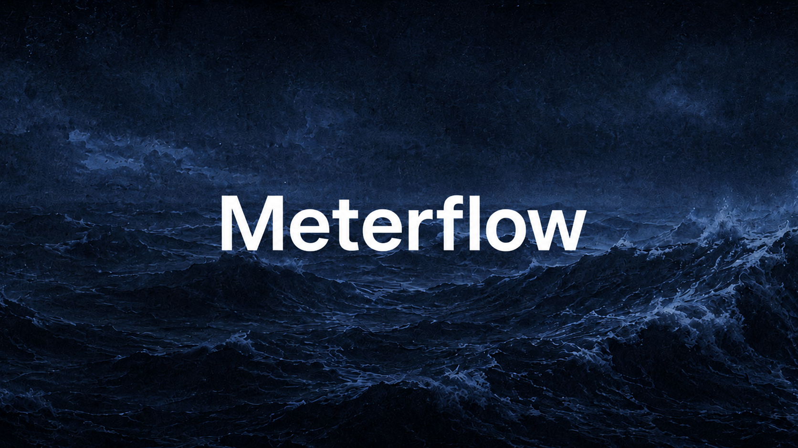

<p align="center">
  
</p>

# Meterflow

The Solana control plane for agent commerce: paid APIs, MCP tools, budgets, receipts, provider revenue, and registry signal.

[Website](https://meterflow.fun) · [Dashboard](https://meterflow.fun/dashboard) · [Docs](https://meterflow.fun/docs) · [GitHub](https://github.com/nullxnothing/meterflow) · [X](https://x.com/meterflowsol) · [Discord](https://discord.gg/tned74z4eN)

<!-- deployment trigger: zauth-registry -->

## $MFLOW

Official contract address: `TBA`

The site and backend use `METERFLOW_TOKEN_CA` as the master token address. Set that env var once when the token is public and Meterflow will use it for the token page, holder checks, and token-gated utility tiers.

## What It Is

Meterflow helps API providers, MCP tool builders, data vendors, and agent operators turn paid requests into observable products. x402 and MPP can move the live payment path; Meterflow manages the product surface around them: hosted gateways, meters, receipts, failed-payment state, provider revenue, agent budgets, payer visibility, registry signal, and signed webhooks. The product model stays protocol-neutral so future 402-style payment rails can normalize into the same receipt and policy layer.

Payments alone are not the product. Meterflow tracks what was sold, who paid, which agent called it, whether policy allowed it, what failed, how much was owed, and where the receipt lives.

## Why It Exists

Agents need paid tools they can call without monthly SaaS accounts, shared credit cards, or unlimited wallet access. API providers need per-request pricing, receipts, budgets, revenue views, registry distribution, and customer visibility after a payment clears.

Meterflow is the layer around that request:

1. Create a meter for an API route, MCP tool, data endpoint, or provider workflow.
2. Connect a Solana wallet for identity, settlement, and admin control.
3. Issue metered client keys or wallet-bound agent budgets.
4. Let agents call paid routes through the gateway.
5. Review receipts, failed payments, spend caps, and provider revenue in the dashboard.

## Product Surfaces

| Surface | What it does |
| --- | --- |
| Meters | Define billable routes, units, prices, assets, providers, and route state |
| Receipts | Track quote, payer, proof, amount, route, policy result, and response status |
| Agent Budgets | Set per-call caps, daily caps, route allowlists, expirations, and revocation |
| MCP Tools | Package tool calls as priced capabilities agents can reason about |
| Protocol Adapter | Normalize x402 and MPP payment flows into one receipt model |
| Provider Registry | Rank endpoints by verification, price, uptime, latency, receipt volume, and utility tier |
| API Keys | Issue metered clients for apps, agents, and provider integrations |
| Settlement Wallet | Inspect wallet context for provider funding and gateway operations |
| Integrations | Attach Solana, payment, wallet, data, webhook, and notification providers |

## Hosted Provider Gateway

Providers can wrap an external API without moving it into the Meterflow app:

```js
const { meter } = await client.createHostedMeter({
  targetUrl: 'https://api.example.com',
  method: 'GET',
  unit: 'lookup',
  priceUsd: 0.01,
  providerName: 'Example Data API',
  status: 'test',
});

console.log(meter.route); // /gateway/mtr_xxxxx/*
```

Meterflow stores the target origin on the meter, generates a hosted route, issues x402 payment requirements for callers, proxies successful requests upstream, and records receipts with upstream status and latency. The payment handshake is only one part of the product; the rest is pricing, policy, revenue, failed-payment state, and accounting. Upstream auth secrets are stored server-side and never returned in meter API responses.

## Agent Commerce Direction

The market is moving toward many payment handshakes, not one winner. Meterflow should be the control plane above those rails:

1. **x402 and MPP, one control plane.** Keep x402 live while MPP opt-in calls normalize into the same receipt schema, gateway policy, and dashboard language.
2. **MCP/API launchpad.** Let providers wrap an existing API or MCP server and receive a hosted paid route, price, budget checks, revenue view, and webhook stream.
3. **Agent budget vaults.** Give operators wallet-bound limits before an agent spends: daily caps, per-call caps, allowlists, revocation, and receipt exports.
4. **Provider registry.** Turn useful paid endpoints into a discoverable market with price, uptime, latency, volume, verification, and MFLOW-backed ranking signals.
5. **Receipt graph.** Treat every paid call as proof: payer, provider, route, amount, payment rail, policy result, response status, latency, and settlement metadata.
6. **Real-time settlement feed.** Stream receipt, payment, budget, and provider revenue events into dashboards and signed webhooks.

## Wrap Your API In 10 Minutes

1. Connect a wallet and create a Meterflow API key.
2. Create a hosted meter with `targetUrl`, `method`, `priceUsd`, `unit`, and optional `providerName`.
3. Test the meter with `POST /v1/meters/:id/test`.
4. Send callers to `https://meterflow.fun/proxy/gateway/{meterId}/...`.
5. Watch receipts, provider revenue, webhook deliveries, and budget decisions in the dashboard.

## Monetize An MCP Tool

Register an MCP tool with `POST /v1/mcp-tools` or create a hosted meter for your MCP HTTP endpoint. Meterflow handles payment quotes, Solana USDC settlement context, receipts, webhooks, registry metadata, and agent budget enforcement. The built-in `/mcp/token-risk` route is a demo of this pattern.

## Agent Budgets And Spend Caps

Agent operators can create budgets with daily caps, per-call caps, and meter allowlists. Budgets let agents call paid APIs without receiving unlimited wallet authority or open-ended API spend.

## Receipts, Settlement, Revenue, And Webhooks

Every metered call can produce a receipt with meter id, route, provider, payer, amount, payment rail, policy result, upstream status, latency, and settlement metadata. Providers can query `/v1/providers/revenue` and subscribe to signed webhooks such as `receipt.created`, `receipt.verified`, and `payment.failed`.

## MPP Payment Rail

MPP is mounted as an additive HTTP 402 rail beside x402. Providers do not create separate meters for MPP; any billable Meterflow route can accept an MPP caller when the gateway is configured with `MPP_SECRET_KEY` and a Solana USDC recipient.

Callers opt into MPP with one of:

- `X-Meterflow-Payment-Protocol: mpp`
- `Accept-Payment: mpp`
- `paymentProtocol=mpp`
- `Authorization: Payment ...` on the paid retry

The current MPP adapter supports the `charge` intent for Solana USDC. An unpaid opt-in request receives an MPP payment challenge. The client pays and retries with `Authorization: Payment ...`. On success, Meterflow forwards the request and returns `Payment-Receipt`, `X-Meterflow-Payment-Protocol: mpp`, and `X-Payment-Transaction` when a Solana reference is available.

MPP receipts are first-class Meterflow receipts. They include `paymentProtocol: "mpp"`, `paymentIntent: "charge"`, `paymentMethod`, `paymentReference`, payer context when provided, route, meter id, amount, policy result, response status, and latency.

## Live Metered Route

The default live paid route is intentionally narrow:

- `POST /mcp/token-risk`

Historical service-route experiments may still exist in the repository, but they are not the Meterflow thesis and are no longer part of the default control-plane surface. The product is the metering, receipt, budget, webhook, provider revenue, MPP/x402 adapter, and settlement layer around provider-owned paid endpoints.

## Repository Layout

| Path | Purpose |
| --- | --- |
| `src/` | Vite/React shell, primary product routes, global background, and legacy-page fallback bridge |
| `src/components/site/HomePage.tsx` | Active React implementation for the landing page |
| `src/components/site/ProductPages.tsx` | Active React implementation for Docs, How It Works, Token, and Roadmap |
| `src/styles/globals.css` | Frontend design tokens, theme variables, and shared `mf-*` component classes |
| `public/site/` | Static fallback and legacy public pages served under `/site/*` |
| `public/dashboard/` | Active wallet-connected dashboard bundle served at `/dashboard/*` |
| `components/ui/` | Shared React UI components used by the Vite shell |
| `api-proxy/` | Express gateway, auth, meters, receipts, budgets, x402, and service routes |
| `sdk/` | JavaScript client for Meterflow routes |
| `skills/meterflow-api/` | Agent skill and provider metadata |
| `docs/frontend-architecture.md` | Frontend source-of-truth and design-system rules |
| `archive/legacy-static-html-2026-05-14/` | Archived pre-Vite root static copies; do not edit for live UI work |

## SDK Quick Start

```js
import { MeterflowClient } from '@meterflow/sdk';

const client = new MeterflowClient({
  apiKey: 'mf_live_xxxxx_secret',
});

const { meter } = await client.createHostedMeter({
  targetUrl: 'https://api.example.com',
  method: 'GET',
  unit: 'lookup',
  priceUsd: 0.01,
});

console.log(meter.route);
```

## Local Development

```bash
npm install
npm run dev
```

The Vite app serves the React shell from `src/`. The landing page and primary product routes (`/`, `/docs`, `/how-it-works`, `/token`, and `/roadmap`) are React pages backed by the shared design system. Static pages in `public/site/` remain available for reference, fallback, and legacy routes. The dashboard remains the existing static bundle under `public/dashboard/` during the migration.

Frontend design-system notes live in `docs/frontend-architecture.md`. New product UI should use `src/styles/globals.css` tokens, shared `mf-*` component classes, and `components/ui/` primitives instead of page-specific one-off styling.

Run API work separately:

```bash
cd api-proxy
cp .env.example .env
npm install
npm run migrate
npm test
npm run dev
```

In production, Vercel serves the Vite build and rewrites `/proxy/*` to the local Vercel Function at `/api/*`.

## Environment

Core API variables:

- `HELIUS_API_KEY`
- `HELIUS_RPC_URL`
- `API_KEY_SECRET`
- `WALLET_ENCRYPTION_SECRET`
- `DATABASE_URL`
- `REDIS_URL`
- `ERROR_ALERT_WEBHOOK` optional, for production error notifications
- `SENTRY_DSN` optional, for stack traces and grouped production errors
- `ZAUTH_API_KEY` optional, enables Zauth x402 provider monitoring before the x402 middleware
- `ZAUTH_API_ENDPOINT` optional SDK backend override; leave unset to use `@zauthx402/sdk` defaults
- `ZAUTH_PUBLIC_APP_URL` optional, defaults to `https://zauth.inc`
- `METERFLOW_PUBLIC_URL` optional, defaults to `https://www.meterflow.fun` for registry/Zauth public endpoint URLs
- `ZAUTH_INCLUDE_ROUTES` optional, defaults to `^/mcp/.*,^/gateway/.*`
- `ZAUTH_EXCLUDE_ROUTES` optional, defaults to health/auth/OAuth/Discord/holder routes
- `ZAUTH_BATCH_SIZE=10` and `ZAUTH_BATCH_WAIT_MS=100` keep telemetry flushing promptly on serverless deployments
- `ZAUTH_REFUNDS_ENABLED=false` by default; set `ZAUTH_SOLANA_PRIVATE_KEY` only if refunds are intentionally enabled

Token and settlement variables:

- `METERFLOW_TOKEN_CA` is the canonical `$MFLOW` contract address used by the whole site, token page, and token-gated utility tiers. Current public CA: `TBA`
- `METERFLOW_TOKEN_MINT` is still supported as a backward-compatible fallback
- `METERFLOW_TOKEN_NAME`, `METERFLOW_TOKEN_SYMBOL`, and `METERFLOW_TOKEN_SWAP_URL` control token page labeling and trade links
- `X402_PAY_TO`, `SETTLEMENT_WALLET`, or `TREASURY_WALLET` for the provider or treasury USDC recipient

Persistence:

- Postgres stores the Meterflow control plane: meters, receipts, agent budgets, MCP tools, webhooks, and idempotency records.
- Redis stores rate limits, API keys, usage counters, and session/cache data.
- Run `npm run migrate` from `api-proxy/` after setting `DATABASE_URL`.

x402 variables:

- `X402_PAY_TO` or `SETTLEMENT_WALLET`
- PayAI hosted facilitator is used by default
- `PAYAI_API_KEY_ID` and `PAYAI_API_KEY_SECRET` optional, for paid PayAI merchant capacity beyond the free tier
- `X402_FACILITATOR_PRIVATE_KEY` or `SETTLEMENT_WALLET_PRIVATE_KEY` optional, only if running an inline facilitator instead of PayAI

MPP variables:

- `MPP_SECRET_KEY` enables MPP challenge signing and verification
- `MPP_PAY_TO` optional, falls back to `X402_PAY_TO` or `SETTLEMENT_WALLET`
- `MPP_SOLANA_NETWORK` defaults to `mainnet-beta`
- `MPP_SOLANA_RPC_URL` optional, falls back to `HELIUS_RPC_URL`
- `METERFLOW_DEFAULT_PAYMENT_PROTOCOL` defaults to `x402`; set to `mpp` only when first 402 challenges should prefer MPP

MPP callers can opt into the MPP rail without changing provider meters by sending `X-Meterflow-Payment-Protocol: mpp`, `Accept-Payment: mpp`, `paymentProtocol=mpp`, or an `Authorization: Payment ...` retry. Verified MPP calls write into the same Meterflow receipts, provider revenue, and webhook model as x402 calls.

## Deployment

Frontend and API are deployed on Vercel at [meterflow.fun](https://meterflow.fun). The API is exposed through `/proxy/*`, which rewrites to a Vercel Function wrapper around the Express app in `api-proxy/app.js`.

For production, attach Postgres and Redis resources to the Vercel project, set the API env vars in Vercel, redeploy, then run the migration against the production `DATABASE_URL`.

GitHub Actions runs `npm test` on pushes and pull requests. The `Production Smoke` workflow also checks the live site and API every 30 minutes. Add a GitHub Actions secret named `METERFLOW_DISCORD_WEBHOOK` if you want failed production smoke runs to post into the private Meterflow alerts channel.

## Production Verification

Use the smoke scripts before and after deploys:

```bash
npm test
npm run smoke:prod
npm run smoke:zauth
npm run smoke:paid
```

`npm run smoke:prod` checks the public site, dashboard assets, docs routes, API health, provider readiness, x402 CORS, and unpaid x402 quote generation.

`npm run smoke:paid` performs a real x402 SVM payment against the production paid route, currently `POST /proxy/mcp/token-risk` at `0.006` USDC. It verifies the 402 quote, signs the payment, submits through the PayAI facilitator, requires an on-chain settlement transaction signature, and checks that the resulting receipt is visible to the paying wallet.

The paid smoke uses the local Solana CLI keypair at `~/.config/solana/id.json` by default. You can override it with `METERFLOW_PAYER_PRIVATE_KEY`, `X402_PAYER_PRIVATE_KEY`, or `SVM_PRIVATE_KEY` using a base58 secret key or JSON-array keypair. Optional overrides include `METERFLOW_SMOKE_BASE_URL`, `METERFLOW_PAID_ROUTE`, `METERFLOW_PAID_TOKEN`, `SOLANA_RPC_URL`, and `HELIUS_RPC_URL`.

`npm run smoke:zauth` validates the Zauth SDK key and endpoint registration path without making a payment. Set `ZAUTH_API_KEY` in the shell or `.env.zauth.local`; optionally set `METERFLOW_ZAUTH_ENDPOINT` to test a non-default public endpoint. The default endpoint is `https://www.meterflow.fun/proxy/mcp/token-risk`.

## License

MIT
